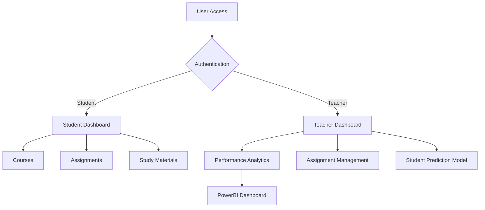

# E-Academy: Secure E-Learning Management System

## Overview
E-Academy is a comprehensive e-learning platform that incorporates advanced security features, content encryption, and student performance prediction capabilities. The platform provides separate interfaces for students and teachers, enabling efficient learning management and performance tracking.

## Key Features
- Secure user authentication system
- Role-based access control (Student/Teacher)
- Encrypted content delivery
- Student performance prediction using Neural Networks
- Interactive dashboards for performance visualization
- Course management system
- Assignment tracking and submission
- Secure study material distribution

## Platform Screenshots

### Homepage

*E-Academy homepage featuring sign-in and registration options*

### Student Home Page

*Student interface showing courses, assignments, and study materials*

### Teacher Dashboard

*Comprehensive teacher dashboard with student performance metrics*

### Performance Prediction Model

*Neural Network-based performance prediction visualization*

## Project Architecture



## Technology Stack
- Frontend: HTML, CSS, JavaScript
- Backend: Python (Flask)
- Database: MongoDB
- Analytics: PowerBI
- Machine Learning: Neural Networks
- Security: Bcrypt, Cipher Substitution

## Repository Structure
```
E-Academy/
├── static/                 # Static files (CSS, JS, Images)
├── templates/             # HTML templates
├── app.py                 # Main application file
├── config.py             # Configuration settings
├── wsgi.py               # WSGI entry point
├── requirements.txt      # Project dependencies
├── procfile              # Heroku deployment file
└── data/
    ├── student_data.csv
    └── enhanced_student_dashboard_data.csv
```

## Installation and Setup

### Prerequisites
- Python 3.8+
- MongoDB
- PowerBI Desktop (for dashboard visualization)

### Clone the Repository
```bash
git clone https://github.com/yourusername/E-Academy.git
cd E-Academy
```

### Environment Setup
```bash
python -m venv venv
source venv/bin/activate  # On Windows: venv\Scripts\activate
pip install -r requirements.txt
```

### Configure MongoDB
1. Create a MongoDB database
2. Update the connection string in `config.py`
```python
MONGO_URI = "your_mongodb_connection_string"
```

### Running the Application
```bash
python wsgi.py
```
The application will be available at `http://localhost:5000`

## Team Members and Contributions
- **Arman**: Frontend Development
- **Piyush**: Responsive Design Implementation
- **Ansh**: Neural Network Model Development
- **Karan**: PowerBI Dashboard and Data Visualization

## License
This project is licensed under the MIT License - see the [LICENSE](LICENSE) file for details.

```
MIT License

Copyright (c) 2024 E-Academy

Permission is hereby granted, free of charge, to any person obtaining a copy
of this software and associated documentation files (the "Software"), to deal
in the Software without restriction, including without limitation the rights
to use, copy, modify, merge, publish, distribute, sublicense, and/or sell
copies of the Software, and to permit persons to whom the Software is
furnished to do so, subject to the following conditions:

The above copyright notice and this permission notice shall be included in all
copies or substantial portions of the Software.

THE SOFTWARE IS PROVIDED "AS IS", WITHOUT WARRANTY OF ANY KIND, EXPRESS OR
IMPLIED, INCLUDING BUT NOT LIMITED TO THE WARRANTIES OF MERCHANTABILITY,
FITNESS FOR A PARTICULAR PURPOSE AND NONINFRINGEMENT. IN NO EVENT SHALL THE
AUTHORS OR COPYRIGHT HOLDERS BE LIABLE FOR ANY CLAIM, DAMAGES OR OTHER
LIABILITY, WHETHER IN AN ACTION OF CONTRACT, TORT OR OTHERWISE, ARISING FROM,
OUT OF OR IN CONNECTION WITH THE SOFTWARE OR THE USE OR OTHER DEALINGS IN THE
SOFTWARE.
```
