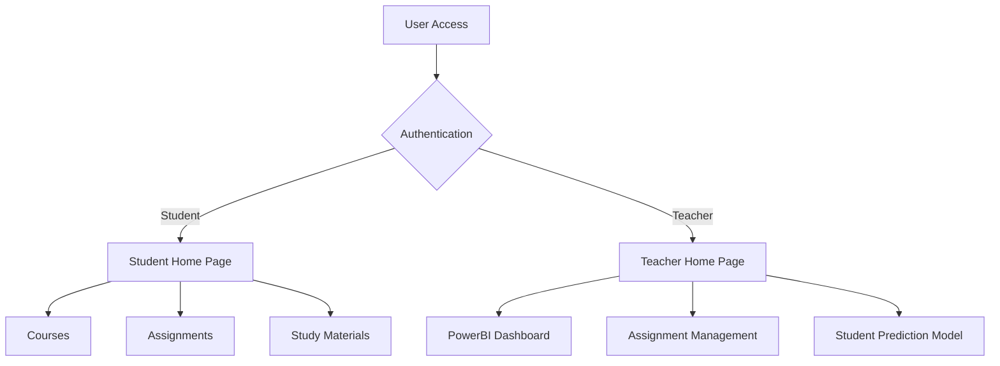

# E-Academy: Secure E-Learning Management System With Content Encryption and Student Performance Prediction Using Neural Networks

## Overview
E-Academy is a comprehensive e-learning platform that incorporates advanced security features, content encryption, and student performance prediction capabilities. The platform provides separate interfaces for students and teachers, enabling efficient learning management and performance tracking.

## Key Features
- Secure user authentication system
- Role-based access control (Student/Teacher)
- Encrypted content delivery
- Student performance prediction using Neural Networks
- Interactive dashboards for performance visualization
- Course management system
- Assignment tracking and submission
- Secure study material distribution

## Branch Structure

- main: Core application code and web interface
- host_model: Contains the TensorFlow Lite model for student performance prediction

     - Separate deployment for optimized model serving
     - Implements API endpoints for model predictions
     - Includes model training scripts and data preprocessing

## Platform Screenshots

### Homepage

*E-Academy homepage featuring sign-in and registration options*

### Student Home Page

*Student interface showing courses, assignments, and study materials*

### Teacher Dashboard

*Comprehensive teacher dashboard with student performance metrics*

### Performance Prediction Model

*Neural Network-based performance prediction visualization*

## Project Architecture



## Technology Stack
- Frontend: HTML, CSS, JavaScript
- Backend: Python (Flask)
- Database: MongoDB
- Analytics: PowerBI
- Machine Learning: Neural Networks, TensorFlow Lite
- Security: Bcrypt, Cipher Substitution

## Repository Structure
```
E-Academy/
│
├── static/                  # Static files (CSS, JS, Images)
│   ├── css/                # Stylesheet files
│   ├── js/                 # JavaScript files
│   └── images/             # Image assets
│
├── templates/              # HTML templates
│   ├── base.html          # Base template
│   ├── student/           # Student-specific templates
│   └── teacher/           # Teacher-specific templates
│
├── app/
│   ├── __init__.py        # Application initialization
│   ├── routes.py          # Application routes
│   ├── models.py          # Data models
│   └── security/          # Security implementations
│       ├── cipher.py      # Custom encryption implementation
│       └── auth.py        # Authentication logic
│
├── model/
│   ├── train.py           # Model training script
│   └── preprocess.py      # Data preprocessing utilities
│
├── data/
│   ├── student_data.csv              # Raw student data
│   └── enhanced_student_dashboard_data.csv  # Processed data for dashboard
│
├── config.py              # Configuration settings
├── wsgi.py               # WSGI entry point
├── requirements.txt       # Project dependencies
└── final_model.ipynb     # Jupyter notebook with model development
```
## Installation and Setup

### Prerequisites
- Python 3.8+
- MongoDB
- PowerBI Desktop (for dashboard visualization)

### Clone the Repository
```bash
https://github.com/anshh-arora/E-Academy.git
cd E-Academy
```

### Environment Setup
```bash
python -m venv venv
source venv/bin/activate  # On Windows: venv\Scripts\activate
pip install -r requirements.txt
```

### Configure MongoDB
1. Create a MongoDB database
2. Update the connection string in `config.py`
```python
MONGO_URI = "your_mongodb_connection_string"
```

### Running the Application
```bash
python wsgi.py
```
The application will be available at `http://localhost:5000`

## Team Members and Contributions
- **Arman**: Frontend Development
- **Piyush**: Responsive Design Implementation
- **Ansh**: Neural Network Model Development
- **Karan**: PowerBI Dashboard and Data Visualization

## Contact Information
For any questions or feedback, feel free to reach out:

- **Email**: [ansharora.cs@gmail.com](mailto:ansharora.cs@gmail.com)
- **LinkedIn**: [Connect with me on LinkedIn](https://www.linkedin.com/in/ansh-arora-data-scientist/)
- **Kaggle**: [Follow me on Kaggle](https://www.kaggle.com/ansh1529)
